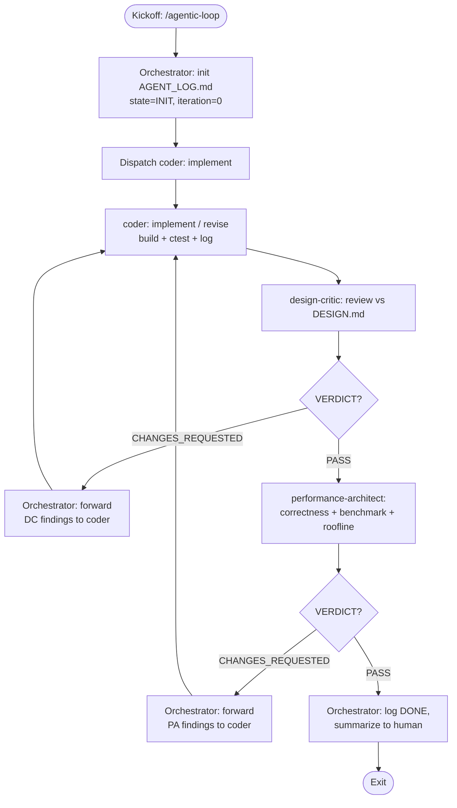
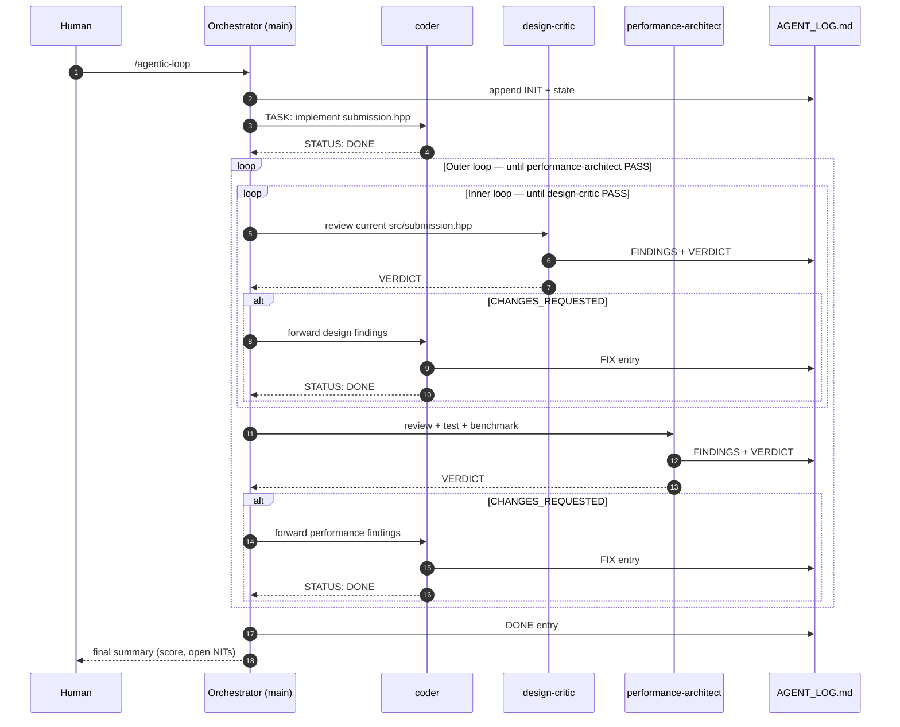

# Agent Orchestration — Nested Design/Performance Review Loop

> **What this is.** An agentic workflow for the UWHPC onboarding task, built on the pi
> harness's subagent facility. Three specialist agents — a **Coder**, a **Design
> Critic**, and a **Performance Architect** — implement and harden
> `src/submission.hpp` through a **small inner loop** (design review) nested inside a
> **large outer loop** (performance review). All three write to one shared,
> append-only log that reads like a group chat: [`AGENT_LOG.md`](./AGENT_LOG.md).
>
> **Loop exit condition:** the Performance Architect returns `VERDICT: PASS`.

---

## 1. TL;DR

| Item | Value |
| --- | --- |
| Orchestrator | The main pi session (not a subagent). It spawns peers and routes findings. |
| Workers | `coder`, `design-critic`, `performance-architect` (project agents). |
| Kickoff | `/agentic-loop [focus]` prompt template, or start the coder directly. |
| Shared state | `AGENT_LOG.md` — append-only group chat + loop state + findings index. |
| Inner loop | coder ↔ design-critic until `VERDICT: PASS`. |
| Outer loop | inner loop → performance-architect; repeat until `VERDICT: PASS`. |
| Exit | performance-architect `VERDICT: PASS`. |
| Spec | `REQUIREMENTS.md`, `DESIGN.md`, `PERFORMANCE.md`. |

---

## 2. Roles and responsibilities

| Role | Kind | Owns | Writes code? | Primary inputs |
| --- | --- | --- | --- | --- |
| **Orchestrator** | Main session | Loop control, routing, state, escalation | No | `AGENT_ORCHESTRATION.md`, `AGENT_LOG.md` |
| **Coder** | Subagent `coder` | `src/submission.hpp` | **Yes** | `REQUIREMENTS.md`, `DESIGN.md`, `PERFORMANCE.md`, `AGENT_LOG.md` |
| **Design Critic** | Subagent `design-critic` | Design-conformance findings | No | `REQUIREMENTS.md`, `DESIGN.md`, `src/submission.hpp`, `AGENT_LOG.md` |
| **Performance Architect** | Subagent `performance-architect` | Correctness + benchmark + roofline findings; final verdict | No | `PERFORMANCE.md`, `DESIGN.md`, `src/submission.hpp`, `AGENT_LOG.md` |

Agent profiles live in [`.pi/agents/`](./.pi/agents/):

- [`.pi/agents/coder.md`](./.pi/agents/coder.md)
- [`.pi/agents/design-critic.md`](./.pi/agents/design-critic.md)
- [`.pi/agents/performance-architect.md`](./.pi/agents/performance-architect.md)

> **Why the orchestrator is not a fourth subagent.** Subagents do not orchestrate other
> subagents here; the main session is the only context that can spawn peers and has the
> user in the loop. Keeping orchestration outside the three specialists also matches the
> design: each specialist has one job and one artifact.

---

## 3. Files and artifact ownership

| Path | Owner | Mutability |
| --- | --- | --- |
| `src/submission.hpp` | Coder | The only submission artifact. |
| `AGENT_LOG.md` | All agents (one writer at a time) | Append-only group chat + state. |
| `REQUIREMENTS.md` | Frozen spec | Read-only for all agents. |
| `DESIGN.md` | Frozen spec | Read-only; changes require orchestrator adjudication. |
| `PERFORMANCE.md` | Frozen spec | Read-only; changes require orchestrator adjudication. |
| `bench/`, `CMakeLists.txt`, `CMakePresets.json`, `.github/` | Harness | Read-only for all agents. |

> **Submission boundary.** Only `src/submission.hpp` is the graded artifact. The `.pi/`
> configs, this document, and the log are process tooling — keep them out of the
> submission discussion, or isolate them on a separate branch/commit. See §11.

---

## 4. The nested loop

### 4.1 Plain-language control flow

1. **Orchestrator** initialises the log and dispatches the **Coder**.
2. **Coder** implements `src/submission.hpp`, builds, tests, logs, hands off.
3. **Design Critic** reviews the code against `DESIGN.md`/`REQUIREMENTS.md`, logs
   findings, returns a verdict.
4. If `CHANGES_REQUESTED`: **Orchestrator** forwards the findings to the **Coder**,
   who fixes them. Back to step 3. **This is the inner loop.**
5. If `PASS`: **Performance Architect** reviews, runs correctness tests, benchmarks,
   inspects vectorisation, checks the roofline, logs findings, returns a verdict.
6. If `CHANGES_REQUESTED`: **Orchestrator** forwards the findings to the **Coder**,
   who fixes them. **Then the inner loop reruns** (steps 3–4) because the code
   changed. Then back to step 5. **This is the outer loop.**
7. If `PASS`: **Orchestrator** logs `DONE` and exits.

### 4.2 Control-flow diagram



The **inner loop** is `CODER → DC → (findings) → CODER`. The **outer loop** wraps it
with the `PA` gate: any coder change re-enters the inner loop before performance is
re-judged.

### 4.3 Sequence diagram



### 4.4 ASCII view (terminal-friendly)

```
            ┌────────────────────────── OUTER LOOP (Performance Architect) ──────────────────────────┐
            │                                                                                        │
  ┌───┐   ┌─▼───┐   ┌───────────────┐  CHANGES   ┌───────────┐   ┌───────────────┐   ┌───────────┐  │
  │INIT├──►│CODER├──►│ DESIGN CRITIC ├───────────►│  CODER    │   │ DESIGN CRITIC │   │ PERFORM.  │  │
  └───┘   └─────┘   └───────┬───────┘   forward  │  (fix)    ├──►│  (re-review)  ├──►│ ARCHITECT │──┘
                            │           findings └───────────┘   └───────┬───────┘   └─────┬─────┘
                            │  PASS                                     ▲                 │
                            └───────────────────────────────────────────┘                 │
                                                                    CHANGES (re-enter      │ PASS
                                                                    inner loop)            ▼
                                                                                        ┌──────┐
                                                                                        │ DONE │
                                                                                        └──────┘
        └────────────────────── INNER LOOP (Design Critic) ──────────────────────┘
```

---

## 5. Step-by-step orchestration protocol

The orchestrator executes exactly this. Subagent names stay constant for the whole run
so their sessions persist across iterations.

| Step | Actor | Action | Wait for |
| --- | --- | --- | --- |
| 0 | Orchestrator | Read `AGENT_LOG.md`; if a run is unfinished, resume from **Current loop state**. | — |
| 1 | Orchestrator | Append `INIT`/`STATE` entry; set `phase=INITIAL`, `iteration=0`, `outer=0`. | — |
| 2 | Orchestrator → Coder | Spawn `coder` with the task + pointer to the log and specs. | Coder handoff |
| 2b | Orchestrator | **Baseline commit (`B`)**: commit the coder's initial implementation + log so reviewers have a stable ref. | — |
| 3 | Orchestrator → Design Critic | Spawn/message `design-critic` to review the current code. | DC handoff |
| 4 | Orchestrator | If `CHANGES_REQUESTED`: message `coder` with the findings; `iteration++`; go to 3. If `PASS`: **inner-loop convergence commit (`CI`)** — commit code + log — then go to 5. | — |
| 5 | Orchestrator → Perf Architect | Spawn/message `performance-architect` to review, test, benchmark. | PA handoff |
| 6 | Orchestrator | If `CHANGES_REQUESTED`: message `coder` with the findings; `outer++`; go to 3 (inner loop must pass again). If `PASS`: **outer-loop convergence commit (`CO`)** — commit code + log — then go to 7. | — |
| 7 | Orchestrator | Append `DONE`; summarize score, iterations, open NITs; stop. | — |

### 5.1 Commit policy at loop boundaries

Commits mark **convergence points**, not every keystroke. Three commit kinds, in order:

| Tag | When | Contents | Message shape |
| --- | --- | --- | --- |
| `B` | Coder's initial implementation is complete, before the first design review. | `src/submission.hpp`, `AGENT_LOG.md` | `feat(submission): initial grid + stencil implementation` |
| `CI` | **Design Critic returns `PASS`** — the exact boundary between the small and big loops. | `src/submission.hpp`, `AGENT_LOG.md` | `fix(submission): design review iteration <n> converged` |
| `CO` | **Performance Architect returns `PASS`** — outer loop converged, run complete. | `src/submission.hpp`, `AGENT_LOG.md` | `perf(submission): performance review converged (score <x>)` |

The `CI` commit is mandatory before every `performance-architect` dispatch: it guarantees the performance review is measured against a committed, design-approved revision, and it records the design approval in history. When performance returns findings, the coder's fix re-enters the inner loop and the next design `PASS` produces a new `CI` commit — so each design-approved revision is a checkpoint.

**Rules.**
- Never commit `src/submission.hpp` in a state that fails `ctest`.
- Keep tooling commits (`.pi/`, orchestration docs) separate from submission commits.
- The orchestrator owns commits; reviewers and the coder must not run `git commit`.
- Do not commit while a subagent is still producing writes to the same files.

**Suggested messages** (keep the loop context in the body):

```text
fix(submission): design review iteration 2 converged

- DC-003 (padding leaked into boundary copy) fixed
- DC-004 (unsigned underflow on rows<3) fixed
- design-critic VERDICT: PASS
```

```text
perf(submission): performance review converged (score 4.1)

- median 34.2 ms over 5 runs, -O3 -march=x86-64-v3, OpenMP on
- roofline: achieved 98 GB/s / best 120 GB/s = 82%
- performance-architect VERDICT: PASS
```

**Harness mechanics.** Use `subagent` to start an agent and `subagent_message` to
continue the *same* named session. The harness delivers results automatically as steer
messages — the orchestrator must **not** poll, sleep, or tail logs.

**Routing findings.** When forwarding, pass the finding IDs and their Fix/Acceptance
fields verbatim; do not paraphrase technical detail. The coder reads `AGENT_LOG.md`
too, so the log is the source of truth and the message is the pointer.

---

## 6. The log as a group chat

`AGENT_LOG.md` is the shared blackboard and the audit trail. Rules:

1. **Append-only.** Never edit or delete prior entries. Corrections are new entries that
   reference the old one.
2. **One writer at a time.** The loop is strictly sequential: exactly one agent is active
   at any moment, so appends never race.
3. **Every finding is in the log**, with an ID, severity, location, rationale, fix, and
   acceptance check. Chat messages are pointers; the log is the record.
4. **Machine-readable tokens.** Reviewers end with a literal `VERDICT: PASS` or
   `VERDICT: CHANGES_REQUESTED`; the coder ends with `STATUS: DONE` or `STATUS: BLOCKED`.
   The orchestrator parses these lines.
5. **Stable IDs.** Design findings are `DC-###`; performance findings are `PA-###`. IDs
   are never reused.
6. **State block is maintained, findings index is derived.** The orchestrator owns the
   **Current loop state** block; reviewers own their findings rows in the open-findings
   index.

### 6.1 Entry header format

```markdown
### [NNNN] YYYY-MM-DD HH:MMZ — <handle> — <TYPE>
```

- `NNNN` — zero-padded, monotonically increasing sequence number.
- `handle` ∈ `orchestrator`, `coder`, `design-critic`, `performance-architect`.
- `TYPE` ∈ `STATE`, `TASK`, `HANDOFF`, `FIX`, `FINDINGS`, `VERDICT`, `DISPUTE`,
  `BLOCKED`, `ACCEPT`, `DONE`.

### 6.2 Finding block format

```markdown
- **DC-003** `MAJOR` — `src/submission.hpp:42`
  - **Issue:** <what is wrong>
  - **Why:** violates `DESIGN.md` D2 / `REQUIREMENTS.md` S2 / UB
  - **Fix:** <exact change to make>
  - **Acceptance:** <how to verify>
```

### 6.3 Severity levels

| Severity | Meaning | Blocks `PASS`? |
| --- | --- | --- |
| `BLOCKER` | Wrong results, UB, race, broken contract. | Yes |
| `MAJOR` | Violates a design decision or a performance requirement. | Yes |
| `MINOR` | Quality/maintainability issue with a concrete fix. | Yes |
| `NIT` | Optional polish. | **No** |

Both reviewers return `PASS` only when there are **zero open `BLOCKER`/`MAJOR`/`MINOR`**
findings. `NIT`s are recorded and may remain open at exit.

### 6.4 A complete cycle, as it appears in the log

```text
[0001] orchestrator — STATE      phase=INITIAL iteration=0 outer=0
[0002] orchestrator — TASK       dispatch coder: implement
[0003] coder        — FIX        changes + evidence        STATUS: DONE
[0004] design-critic— FINDINGS   DC-001 [MAJOR] ...        VERDICT: CHANGES_REQUESTED
[0005] orchestrator — STATE      forward DC-001 -> coder; iteration=1
[0006] coder        — FIX        DC-001 FIXED ...          STATUS: DONE
[0007] design-critic— VERDICT    no findings                VERDICT: PASS
[0008] performance-architect — FINDINGS  PA-001 [MAJOR] ... VERDICT: CHANGES_REQUESTED
[0009] orchestrator — STATE      forward PA-001 -> coder; outer=1
[0010] coder        — FIX        PA-001 FIXED ...          STATUS: DONE
[0011] design-critic— VERDICT    re-review after change     VERDICT: PASS
[0012] performance-architect — VERDICT   score 4.1 >= 3.0    VERDICT: PASS
[0013] orchestrator — DONE       exit
```

---

## 7. Termination, budgets, and circuit breakers

| Guard | Default | On breach |
| --- | --- | --- |
| Inner-loop iterations per outer pass | `MAX_INNER = 5` | Escalate: orchestrator reviews the disagreement and either adjudicates or asks the human. |
| Outer-loop iterations | `MAX_OUTER = 6` | Stop and report partial results with the blocking findings. |
| Wall-clock budget | optional | Stop at the next agent boundary and report state. |
| Repeated identical finding | 2 occurrences | Treat as an impasse; escalate rather than loop. |
| Coder `STATUS: BLOCKED` | immediate | Orchestrator adjudicates a design dispute or escalates to the human. |
| Reviewer disagreement | immediate | Orchestrator decides using the frozen specs, or escalates. |

**Termination is exact:** the run ends if and only if `performance-architect` returns
`VERDICT: PASS` and the orchestrator has written the `DONE` entry. Everything else —
including a good score below the architect's target — is a `CHANGES_REQUESTED` or an
escalation, not an exit.

---

## 8. Configuring the run

Set these in the kickoff message or the log's state block:

| Knob | Default | Meaning |
| --- | --- | --- |
| `SCORE_TARGET` | `3.0` | Score the performance architect must reach (or justify via roofline). |
| `ROOFLINE_EFFICIENCY` | `70%` | Alternative pass bar: achieved / best streaming bandwidth. |
| `MAX_INNER` | `5` | Inner-loop circuit breaker. |
| `MAX_OUTER` | `6` | Outer-loop circuit breaker. |
| `ARCH_FLAGS` | `-O3 -march=x86-64-v3` | Evaluator-like benchmark flags. |
| `THREADS` | runtime default | Leave to OpenMP; may sweep `1,2,4,8,...` for scaling evidence. |
| `RUNS` | `5` | Benchmark repetitions for a median. |

---

## 9. Failure handling

| Situation | Response |
| --- | --- |
| Subagent fails to start / exits non-zero | Orchestrator retries once; if it fails again, logs `BLOCKED` and escalates. |
| Build failure | Coder reports `STATUS: BLOCKED` with the compiler error; orchestrator re-dispatches with the error if it is mechanical. |
| Public test failure | Coder fixes before handoff; a reviewer that finds one raises a `BLOCKER`. |
| Coder disputes a finding | `DISPUTE` entry with evidence. If a reviewer accepts, it logs `ACCEPT` and drops the finding; otherwise the orchestrator adjudicates. |
| Two reviewers disagree | Orchestrator decides against the frozen specs (`REQUIREMENTS.md` > `DESIGN.md` > `PERFORMANCE.md` for correctness; `PERFORMANCE.md` for speed). |
| Impasse / budget breach | Stop at the next boundary; hand the human the state block and open findings. |
| Submission boundary concern | Keep process files off the graded branch/commit; only `src/submission.hpp` is graded. |

---

## 10. How to run it

**Prerequisite:** the project is trusted (project agents in `.pi/agents/` are
project-scoped) and the three agents are discoverable via `subagents_list`.

**Option A — prompt template (recommended):**

```text
/agentic-loop implement the full submission end-to-end
/agentic-loop optimize OpenMP scaling; SCORE_TARGET=4
```

**Option B — talk to the orchestrator directly:**

```text
Read AGENT_ORCHESTRATION.md and AGENT_LOG.md, then run the nested review loop:
spawn `coder`, then loop design-critic until PASS, then performance-architect until PASS.
```

**Option C — resume an interrupted run:**

```text
Resume the loop from the Current loop state in AGENT_LOG.md.
```

The orchestrator keeps subagent names `coder`, `design-critic`, and
`performance-architect` constant, so re-messaging continues the same sessions.

---

## 11. Submission-boundary hygiene

The UWHPC submission is a PR whose only graded change is `src/submission.hpp`. This
orchestration adds process files (`.pi/`, `AGENT_*.md`). To avoid muddying the review:

- Keep the agent tooling on a separate branch or a separate commit series, or
- Open the submission PR from a branch that contains only the `src/submission.hpp`
  change, with the tooling living on your working branch, and
- Never edit `bench/`, `CMakeLists.txt`, `CMakePresets.json`, or `.github/` from any
  agent.

The design chat with UWHPC is about **your** reasoning. Use the agents to pressure-test
and sharpen the design, but be ready to explain and defend every decision yourself — the
`AGENT_LOG.md` findings are a trail of *why* the code looks the way it does.

---

## 12. Why this shape (design rationale)

- **One writer per artifact.** The coder is the only one who edits the submission;
  reviewers only observe and report. This makes the diff attributable and avoids
  thrashing.
- **Inner before outer.** Performance review is expensive (builds, benchmarks, reports).
  Gate it behind a clean design review so expensive passes are not spent on code that is
  about to change structurally.
- **Any code change invalidates both verdicts.** That is why the outer loop re-enters
  the inner loop: a performance fix is still a code change and must satisfy the design
  contract before performance is re-measured.
- **The log is the state.** Because subagents have isolated contexts, the append-only
  log is the only reliable shared memory. Findings, evidence, and verdicts live there,
  not in ephemeral chat.
- **Nested loops map to ownership.** The Design Critic owns "is this the design we agreed
  on?"; the Performance Architect owns "is it fast and correct enough to ship?" Combining
  them would blur two different failure modes.

---

## 13. Quick reference card

```text
Agents:   coder | design-critic | performance-architect      (+ orchestrator = main)
Spec:     REQUIREMENTS.md | DESIGN.md | PERFORMANCE.md
Log:      AGENT_LOG.md          (append-only group chat + state)
Code:     src/submission.hpp    (ONLY graded artifact)
Kickoff:  /agentic-loop [focus]

INNER loop:  coder → design-critic → (findings → coder)* → PASS
OUTER loop:  INNER → performance-architect → (findings → coder → INNER)* → PASS → DONE

Exit iff: performance-architect says VERDICT: PASS.
Tokens:   VERDICT: PASS | VERDICT: CHANGES_REQUESTED | STATUS: DONE | STATUS: BLOCKED
IDs:      DC-### (design) | PA-### (performance)
Severity: BLOCKER/MAJOR/MINOR block PASS; NIT does not.
```
